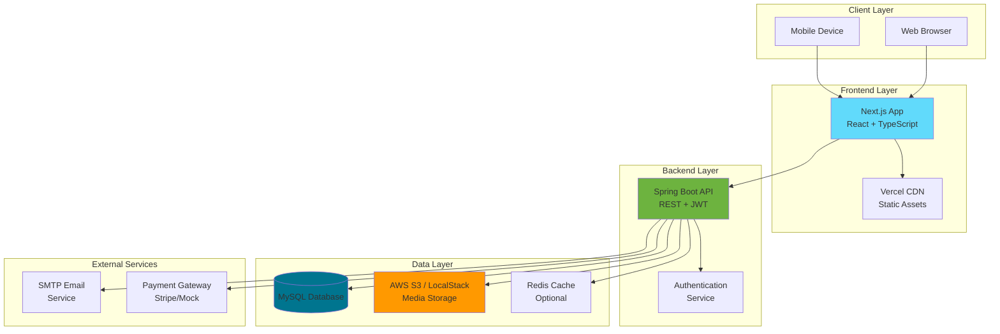
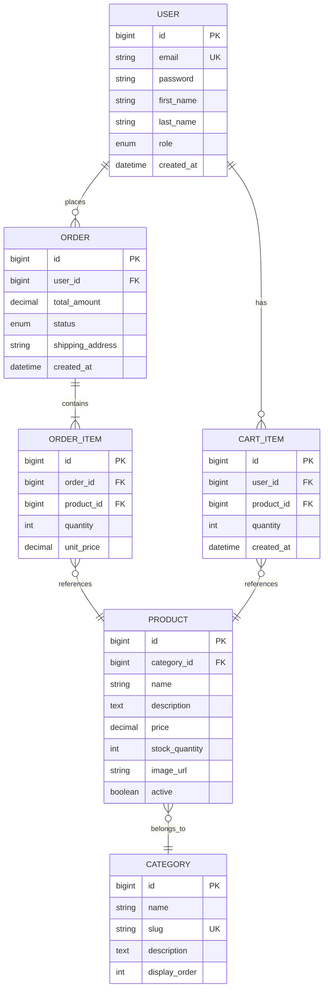
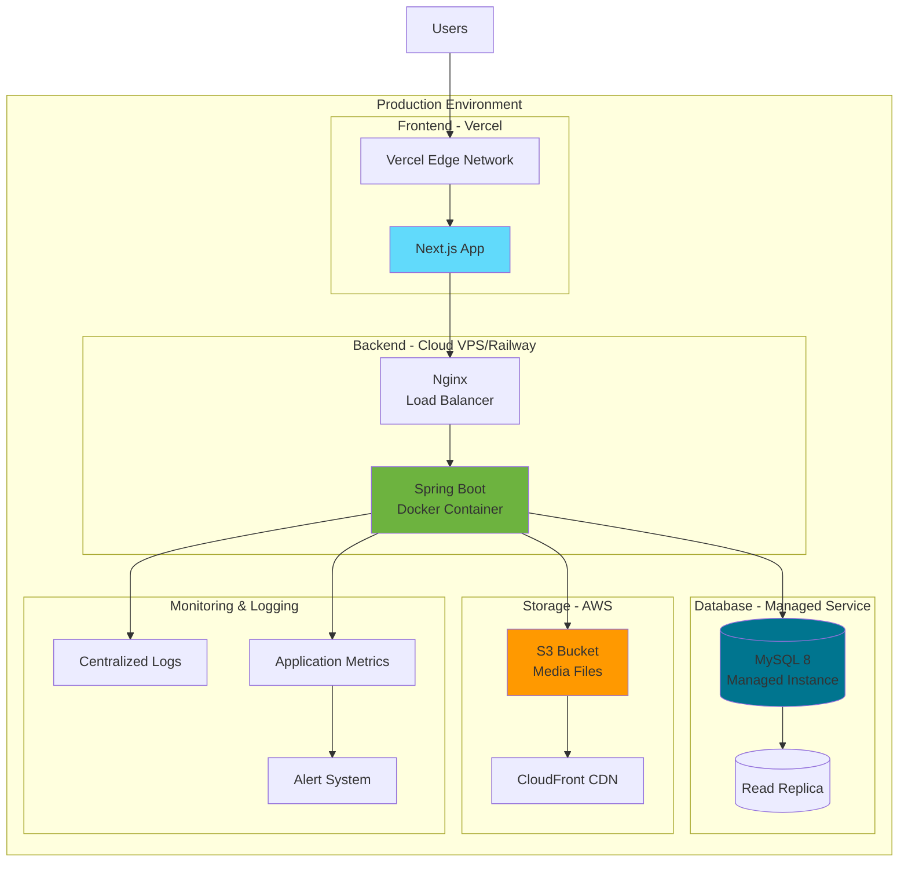

<div align="center">

# 🍯 Dar Lemlih Apiculture

### Production-Ready Multilingual E-Commerce Platform for Artisanal Honey Products

[](https://github.com/SalimTag/dar-lemlih-apiculture/actions)
[](https://opensource.org/licenses/MIT)
[](https://spring.io/projects/spring-boot)
[](https://nextjs.org/)
[](https://www.typescriptlang.org/)
[](https://www.docker.com/)
[](CONTRIBUTING.md)

[Features](#-features) • [Demo](#-demo) • [Tech Stack](#-tech-stack) • [Quick Start](#-quick-start) • [Documentation](#-documentation) • [Contributing](#-contributing)

---

**📚 Complete Documentation Available:**
[API Reference](docs/API.md) •
[Development Guide](docs/DEVELOPMENT.md) •
[Contributing](CONTRIBUTING.md) •
[Changelog](CHANGELOG.md)

</div>

---

## 📖 About

**Dar Lemlih Apiculture** is a modern, full-stack e-commerce platform built specifically for selling traditional Moroccan honey and artisanal beekeeping products. The platform showcases best practices in web development with a focus on **internationalization**, **security**, and **scalability**.

### Why This Project?

This project demonstrates proficiency in:
- 🎯 Full-stack development with modern frameworks
- 🌐 Building multilingual applications with RTL support
- 🔐 Implementing secure authentication and authorization
- 💳 Integrating payment gateways
- 🐳 Containerization and deployment
- 🧪 Comprehensive testing strategies
- 📱 Responsive and accessible UI design

## ✨ Features

### 🛍️ Customer Experience
- **Multilingual Interface**: Seamlessly switch between French, English, and Arabic with full RTL support
- **Product Discovery**: Advanced search and filtering for honey varieties by region, type, and properties
- **Smart Cart**: Persistent shopping cart with real-time price calculations
- **Secure Checkout**: Streamlined checkout flow with multiple payment options
- **Order Tracking**: Real-time order status updates and history
- **User Profiles**: Manage personal information, addresses, and preferences

### 👨‍💼 Admin Dashboard
- **Analytics Dashboard**: Real-time sales metrics, revenue tracking, and customer insights
- **Product Management**: Full CRUD operations for products, categories, and inventory
- **Order Fulfillment**: Process orders, update statuses, and manage shipments
- **User Management**: Role-based access control and user administration
- **Content Management**: Update site content, banners, and promotional materials

### 🔒 Security & Performance
- JWT-based authentication with refresh token rotation
- BCrypt password hashing
- Role-based access control (RBAC)
- Rate limiting on sensitive endpoints
- CORS protection
- SQL injection prevention
- XSS protection
- Optimized database queries with proper indexing

## 📸 Demo

> 🚧 **Live Demo**: Coming soon! The application will be deployed to production shortly.

### Screenshots

#### Customer Storefront
*Product browsing, multilingual support, and seamless checkout experience*

#### Admin Dashboard
*Comprehensive analytics, product management, and order fulfillment*

*Screenshots will be added upon deployment*

## 🛠️ Tech Stack

### Backend
- **Framework**: Spring Boot 3.2
- **Language**: Java 21
- **Database**: MySQL 8
- **ORM**: Spring Data JPA with Hibernate
- **Migrations**: Flyway
- **Security**: Spring Security with JWT
- **API Docs**: OpenAPI 3.0 (Swagger UI)
- **Build Tool**: Maven
- **Testing**: JUnit 5, Mockito, Spring Boot Test

### Frontend
- **Framework**: Next.js 14 (React 18)
- **Language**: TypeScript 5.6
- **Styling**: Tailwind CSS 3.4
- **UI Components**: shadcn/ui (Radix UI)
- **State Management**: Zustand 4.5
- **Internationalization**: next-intl
- **Forms**: React Hook Form + Zod validation
- **Testing**: Vitest, Playwright
- **Build Tool**: Turbopack (Next.js)

### Infrastructure & DevOps
- **Containerization**: Docker, Docker Compose
- **Storage**: LocalStack S3 (development), AWS S3 (production)
- **Email**: MailHog (dev), SMTP (production)
- **CI/CD**: GitHub Actions
- **Monitoring**: Spring Boot Actuator
- **Database Admin**: phpMyAdmin

### Payment Integration
- Provider-agnostic architecture
- Mock provider for development
- Stripe integration ready
- Extensible for other providers

## 🗂️ Project Structure

```
dar-lemlih-apiculture/
├── apps/
│   ├── api/                           # Spring Boot Backend API
│   │   ├── src/main/java/
│   │   │   └── ma/darlemlih/
│   │   │       ├── config/            # Spring configurations
│   │   │       ├── controller/        # REST controllers
│   │   │       ├── dto/               # Data Transfer Objects
│   │   │       ├── entity/            # JPA entities
│   │   │       ├── repository/        # Data access layer
│   │   │       ├── service/           # Business logic
│   │   │       ├── security/          # JWT & security
│   │   │       └── exception/         # Custom exceptions
│   │   ├── src/main/resources/
│   │   │   ├── db/migration/          # Flyway SQL migrations
│   │   │   └── application.yml        # Configuration
│   │   ├── src/test/                  # Backend tests
│   │   └── pom.xml                    # Maven dependencies
│   │
│   └── web/                           # Next.js Frontend
│       ├── src/
│       │   ├── app/                   # Next.js app router
│       │   ├── components/            # React components
│       │   │   ├── ui/                # shadcn/ui components
│       │   │   ├── auth/              # Authentication forms
│       │   │   ├── products/          # Product displays
│       │   │   └── cart/              # Shopping cart
│       │   ├── lib/                   # Utilities & helpers
│       │   ├── hooks/                 # Custom React hooks
│       │   ├── stores/                # Zustand stores
│       │   └── types/                 # TypeScript types
│       ├── public/                    # Static assets
│       ├── messages/                  # i18n translations
│       └── package.json               # NPM dependencies
│
├── infra/
│   └── docker/
│       ├── docker-compose.yml         # Development stack
│       ├── Dockerfile.api             # Backend image
│       ├── Dockerfile.web             # Frontend image
│       └── localstack/                # S3 mock setup
│
├── .github/
│   └── workflows/
│       └── ci.yml                     # GitHub Actions CI/CD
│
├── CONTRIBUTING.md                    # Contribution guidelines
├── CODE_OF_CONDUCT.md                 # Community guidelines
├── CHANGELOG.md                       # Version history
├── LICENSE                            # MIT License
└── README.md                          # This file
```

## 🚀 Quick Start

### Prerequisites

Before you begin, ensure you have the following installed:

- **Docker** 20.10+ and **Docker Compose** 2.0+
- **Java** 21 (for local backend development)
- **Node.js** 20+ and **npm** (for local frontend development)
- **MySQL** 8+ (optional, Docker includes it)
- **Git**

### Installation & Setup

#### Option 1: Docker Compose (Recommended)

The fastest way to get the entire stack running:

```bash
# 1. Clone the repository
git clone https://github.com/SalimTag/dar-lemlih-apiculture.git
cd dar-lemlih-apiculture

# 2. Start all services with Docker Compose
docker-compose -f infra/docker/docker-compose.yml up -d

# 3. Wait for services to be ready (about 30 seconds)
# Check health status
docker-compose -f infra/docker/docker-compose.yml ps

# 4. Seed demo data (products, categories, users)
curl -X POST http://localhost:8080/api/admin/seed

# 5. Reset passwords for default users
curl -X POST http://localhost:8080/api/admin/reset-passwords
```

**🎉 That's it!** Your application is now running.

#### Option 2: Local Development Setup

For active development with hot reload:

**Backend Setup:**
```bash
# Navigate to backend
cd apps/api

# Copy environment file
cp .env.example .env
# Edit .env with your configuration

# Start MySQL (via Docker or local)
docker run -d --name mysql-darlemlih \
  -e MYSQL_ROOT_PASSWORD=root \
  -e MYSQL_DATABASE=darlemlih \
  -e MYSQL_USER=dar \
  -e MYSQL_PASSWORD=lemlih \
  -p 3306:3306 mysql:8

# Run the application
./mvnw spring-boot:run
```

**Frontend Setup:**
```bash
# Navigate to frontend
cd apps/web

# Copy environment file
cp .env.example .env
# Edit .env with your configuration

# Install dependencies
npm install

# Start development server
npm run dev
```

### Accessing the Application

Once running, access the services at:

| Service | URL | Description |
|---------|-----|-------------|
| 🌐 **Frontend** | http://localhost:5173 | Customer storefront |
| 🔧 **Backend API** | http://localhost:8080 | REST API |
| 📚 **API Docs** | http://localhost:8080/swagger-ui.html | Interactive API documentation |
| 💾 **Database Admin** | http://localhost:8090 | phpMyAdmin (user: `dar`, password: `lemlih`) |
| 📧 **Email Inbox** | http://localhost:8025 | MailHog email testing |
| 📊 **Health Check** | http://localhost:8080/actuator/health | Service health status |

### Default Credentials

| Role | Email | Password |
|------|-------|----------|
| **Admin** | admin@darlemlih.ma | Admin!234 |
| **Customer** | customer@darlemlih.ma | Customer!234 |

### First Steps

1. **Browse Products**: Visit http://localhost:5173 and explore the honey catalog
2. **Try Checkout**: Add products to cart and test the checkout flow
3. **Access Admin**: Login with admin credentials to access the dashboard
4. **View API Docs**: Check http://localhost:8080/swagger-ui.html for API endpoints
5. **Test Email**: Register a new account and check http://localhost:8025 for the confirmation email

## 🌐 Internationalization (i18n)

The platform provides comprehensive multilingual support:

| Language | Code | Direction | Status |
|----------|------|-----------|--------|
| 🇫🇷 French | `fr` | LTR | ✅ Complete |
| 🇬🇧 English | `en` | LTR | ✅ Complete |
| 🇸🇦 Arabic | `ar` | RTL | ✅ Complete with RTL support |

### Features
- **Automatic Language Detection**: Based on browser preferences
- **RTL Layout Support**: Proper right-to-left rendering for Arabic
- **Currency Formatting**: Locale-aware price display
- **Date & Time**: Localized date/time formatting
- **Persistent Selection**: Language choice saved in user preferences

### Adding a New Language

1. Add translations in `apps/web/messages/{locale}.json`
2. Update `apps/web/middleware.ts` with the new locale
3. Add locale to `VITE_APP_SUPPORTED_LANGS` in `.env`

## 📸 Media Storage

Product images are handled through a flexible storage abstraction:

### LocalStack S3 (Development)
- **Enabled by default** with `STORAGE_S3_ENABLED=true`
- Uploads target LocalStack S3 endpoint at `http://localhost:4566`
- Files stored in the `media` bucket (auto-created on startup)
- Perfect for local development without AWS credentials

### Filesystem Storage (Alternative)
- Set `STORAGE_S3_ENABLED=false` for pure filesystem storage
- Files stored under `./uploads` directory
- Automatically served at `/uploads/*` endpoint
- Useful for quick prototyping

### Production (AWS S3)
- Update AWS credentials and endpoint in production `.env`
- Supports any S3-compatible storage (AWS, DigitalOcean Spaces, etc.)
- Configurable upload limits and allowed file types

### Configuration

```bash
# S3/LocalStack Configuration
STORAGE_S3_ENABLED=true
AWS_ENDPOINT_URL=http://localhost:4566
AWS_PUBLIC_ENDPOINT=http://localhost:4566
AWS_REGION=us-east-1
AWS_ACCESS_KEY_ID=test
AWS_SECRET_ACCESS_KEY=test
S3_BUCKET=media

# Upload Limits
UPLOAD_MAX_SIZE=5242880           # 5MB in bytes
UPLOAD_MAX_FILES=5                 # Max simultaneous uploads
UPLOAD_ALLOWED_EXTENSIONS=jpg,jpeg,png,webp
UPLOAD_ALLOWED_CONTENT_TYPES=image/jpeg,image/png,image/webp
```

### Default Credentials

- **Admin**: admin@darlemlih.ma / Admin!234
- **Customer**: customer@darlemlih.ma / Customer!234

## 🧪 Testing

### Backend Tests

```bash
cd apps/api

# Run all tests
./mvnw test

# Run with coverage
./mvnw clean verify

# Run specific test class
./mvnw test -Dtest=ProductServiceTest

# Run integration tests only
./mvnw verify -P integration-tests
```

### Frontend Tests

```bash
cd apps/web

# Run unit tests
npm test

# Run tests in watch mode
npm run test:watch

# Type checking
npm run typecheck

# Linting
npm run lint
```

### End-to-End Tests

```bash
cd apps/web

# Install Playwright browsers (first time only)
npx playwright install --with-deps

# Start the full stack
docker-compose -f ../../infra/docker/docker-compose.yml up -d

# Wait for services to be ready
for i in {1..60}; do curl -fsS http://localhost:8080/actuator/health && break || sleep 2; done

# Run E2E tests
npm run playwright:test

# Run with UI
npx playwright test --ui

# View test report
npx playwright show-report
```

### Test Coverage

Current test coverage:
- **Backend**: Unit and integration tests for services, repositories, and controllers
- **Frontend**: Component tests and E2E flows
- **API**: OpenAPI spec validation

## 📦 Production Deployment

### Docker Images

Build production-ready Docker images:

```bash
# Build backend image
docker build -f infra/docker/Dockerfile.api -t darlemlih-api:latest apps/api

# Build frontend image
docker build -f infra/docker/Dockerfile.web -t darlemlih-web:latest apps/web

# Test the images
docker run -p 8080:8080 darlemlih-api:latest
docker run -p 3000:3000 darlemlih-web:latest
```

### Deployment Options

#### Option 1: Docker Compose (VPS/Cloud VM)

```bash
# 1. Copy your production docker-compose.yml
cp infra/docker/docker-compose.prod.yml docker-compose.yml

# 2. Set environment variables
export DB_PASSWORD=secure_password
export JWT_SECRET=secure_jwt_secret_min_256_bits

# 3. Deploy
docker-compose up -d

# 4. Run migrations
docker-compose exec api ./mvnw flyway:migrate
```

#### Option 2: Kubernetes

```bash
# Apply Kubernetes manifests
kubectl apply -f infra/k8s/

# Check deployment status
kubectl get pods
kubectl get services
```

#### Option 3: Cloud Platform (Vercel/Railway/Render)

**Frontend (Vercel):**
```bash
cd apps/web
vercel --prod
```

**Backend (Railway/Render):**
- Connect your GitHub repository
- Set environment variables via dashboard
- Deploy automatically on push

### Environment Variables (Production)

#### Backend Required Variables

```bash
# Database
DB_URL=jdbc:mysql://your-db-host:3306/darlemlih?useSSL=true
DB_USER=your_db_user
DB_PASSWORD=your_secure_password

# JWT (IMPORTANT: Use strong secrets)
JWT_SECRET=your_super_secure_secret_key_minimum_256_bits
JWT_ACCESS_TTL_MIN=15
JWT_REFRESH_TTL_DAYS=7

# SMTP Email
SMTP_HOST=smtp.gmail.com
SMTP_PORT=587
SMTP_USER=your-email@gmail.com
SMTP_PASS=your-app-password
MAIL_FROM=noreply@darlemlih.ma

# Payment Provider
PAYMENT_PROVIDER=stripe
STRIPE_SECRET_KEY=sk_live_...
STRIPE_WEBHOOK_SECRET=whsec_...

# AWS S3 (for production)
STORAGE_S3_ENABLED=true
AWS_ENDPOINT_URL=
AWS_REGION=us-east-1
AWS_ACCESS_KEY_ID=your_access_key
AWS_SECRET_ACCESS_KEY=your_secret_key
S3_BUCKET=darlemlih-media

# URLs
APP_BASE_URL=https://api.darlemlih.ma
WEB_BASE_URL=https://darlemlih.ma
CORS_ALLOWED_ORIGINS=https://darlemlih.ma,https://www.darlemlih.ma
```

#### Frontend Required Variables

```bash
VITE_API_URL=https://api.darlemlih.ma
VITE_APP_DEFAULT_LANG=fr
VITE_APP_SUPPORTED_LANGS=fr,en,ar
VITE_PAYMENT_PROVIDER=stripe
```

### Security Checklist

Before deploying to production:

- [ ] Change all default passwords
- [ ] Use strong JWT secret (min 256 bits)
- [ ] Enable HTTPS (SSL/TLS certificates)
- [ ] Set secure CORS origins
- [ ] Use production database with backups
- [ ] Enable rate limiting
- [ ] Configure proper logging
- [ ] Set up monitoring and alerts
- [ ] Use environment variables (never commit secrets)
- [ ] Enable CSRF protection
- [ ] Configure firewall rules
- [ ] Set up automated backups
- [ ] Review and test all security headers

## 🔌 API Documentation

The REST API is documented using OpenAPI 3.0 specification.

### Interactive Documentation

Access the interactive Swagger UI at:
- **Local**: http://localhost:8080/swagger-ui.html
- **Production**: https://api.darlemlih.ma/swagger-ui.html

### OpenAPI Specification

Download the OpenAPI JSON specification:
- **Local**: http://localhost:8080/v3/api-docs
- **Production**: https://api.darlemlih.ma/v3/api-docs

### Key API Endpoints

#### Authentication
```
POST   /api/auth/register          # Register new user
POST   /api/auth/login             # Login and get JWT tokens
POST   /api/auth/refresh           # Refresh access token
POST   /api/auth/logout            # Logout (invalidate tokens)
GET    /api/auth/me                # Get current user info
```

#### Products
```
GET    /api/products               # List all products (public)
GET    /api/products/{id}          # Get product details
POST   /api/admin/products         # Create product (admin)
PUT    /api/admin/products/{id}    # Update product (admin)
DELETE /api/admin/products/{id}    # Delete product (admin)
```

#### Categories
```
GET    /api/categories             # List categories (public)
POST   /api/admin/categories       # Create category (admin)
```

#### Orders
```
GET    /api/orders                 # List user's orders
GET    /api/orders/{id}            # Get order details
POST   /api/orders                 # Create new order
GET    /api/admin/orders           # List all orders (admin)
PUT    /api/admin/orders/{id}      # Update order status (admin)
```

#### Cart
```
GET    /api/cart                   # Get user's cart
POST   /api/cart/items             # Add item to cart
PUT    /api/cart/items/{id}        # Update cart item
DELETE /api/cart/items/{id}        # Remove item from cart
DELETE /api/cart                   # Clear cart
```

### Authentication

Most endpoints require JWT authentication. Include the access token in the Authorization header:

```bash
curl -H "Authorization: Bearer YOUR_ACCESS_TOKEN" \
     http://localhost:8080/api/orders
```

## 🔒 Security Features

This application implements multiple layers of security:

### Authentication & Authorization
- **JWT Tokens**: Secure token-based authentication with access (15min) and refresh (7 days) tokens
- **Token Rotation**: Refresh tokens are rotated on each use
- **Password Hashing**: BCrypt with configurable strength (default: 12 rounds)
- **Role-Based Access Control**: ADMIN and CUSTOMER roles with granular permissions
- **Session Management**: Stateless authentication with secure token storage

### Data Protection
- **SQL Injection Prevention**: Parameterized queries via JPA
- **XSS Protection**: Input sanitization and output encoding
- **CSRF Protection**: Token-based CSRF protection for state-changing operations
- **Data Validation**: Schema validation on all API inputs using Bean Validation
- **Sensitive Data**: Environment variables for secrets, never committed to git

### Network Security
- **CORS**: Configurable cross-origin resource sharing
- **HTTPS**: TLS/SSL encryption in production
- **Rate Limiting**: Protection against brute force attacks on auth endpoints
- **Request Size Limits**: Protection against large payload attacks

### Application Security
- **Security Headers**: Proper HTTP security headers (X-Frame-Options, X-Content-Type-Options, etc.)
- **Error Handling**: Generic error messages to prevent information disclosure
- **Logging**: Security events logged for audit trails
- **Dependencies**: Regular updates and security scanning

### JWT Security Details

```java
// Token Structure
{
  "sub": "user@example.com",           // Subject (user email)
  "iat": 1234567890,                   // Issued at timestamp
  "exp": 1234568790,                   // Expiration timestamp (15min)
  "roles": ["ROLE_CUSTOMER"],          // User authorities
  "type": "access"                     // Token type
}

// Signing Algorithm: HS256
// Secret: Configurable via JWT_SECRET (min 256 bits recommended)
```

## 🏗️ Architecture

### System Architecture



### Backend Architecture (Layered)

```mermaid
graph TB
    subgraph "Presentation Layer"
        Controller[Controllers<br/>@RestController]
        DTOs[DTOs<br/>Request/Response]
    end
    
    subgraph "Business Layer"
        Service[Services<br/>@Service]
        Validation[Validation<br/>Business Rules]
    end
    
    subgraph "Persistence Layer"
        Repository[Repositories<br/>@Repository]
        Entity[Entities<br/>@Entity]
    end
    
    subgraph "Cross-Cutting"
        Security[Security<br/>JWT Filter]
        Exception[Exception<br/>Handler]
        Logging[Logging<br/>Aspect]
    end
    
    Controller --> DTOs
    Controller --> Service
    Service --> Validation
    Service --> Repository
    Repository --> Entity
    Entity --> MySQL[(MySQL DB)]
    
    Security -.-> Controller
    Exception -.-> Controller
    Logging -.-> Service
    
    style Controller fill:#6db33f
    style Service fill:#68bc71
    style Repository fill:#86c571
    style MySQL fill:#00758f
```

### Authentication Flow

```mermaid
sequenceDiagram
    participant Client as Client Browser
    participant API as Spring Boot API
    participant DB as MySQL Database
    
    Note over Client,DB: User Login
    Client->>+API: POST /api/auth/login<br/>{email, password}
    API->>+DB: Query user by email
    DB-->>-API: User data + hashed password
    API->>API: Verify BCrypt password
    API->>API: Generate JWT tokens<br/>(access + refresh)
    API-->>-Client: {accessToken, refreshToken, user}
    
    Note over Client,DB: Authenticated Request
    Client->>+API: GET /api/orders<br/>Authorization: Bearer {accessToken}
    API->>API: Validate JWT signature<br/>Check expiration
    API->>+DB: Query orders for user
    DB-->>-API: Order data
    API-->>-Client: {orders: [...]}
    
    Note over Client,DB: Token Refresh
    Client->>+API: POST /api/auth/refresh<br/>{refreshToken}
    API->>API: Validate refresh token
    API->>API: Generate new access token
    API->>API: Rotate refresh token
    API-->>-Client: {accessToken, refreshToken}
    
    style Client fill:#61dafb
    style API fill:#6db33f
    style DB fill:#00758f
```

### Database Schema (Simplified)



### Deployment Architecture



## 🌍 Environment Variables

### Backend Environment Variables

Complete list of backend configuration options:

```bash
# Spring Profile
SPRING_PROFILES_ACTIVE=dev              # dev, prod, or test

# Database Configuration
DB_URL=jdbc:mysql://localhost:3306/darlemlih?createDatabaseIfNotExist=true&useSSL=false
DB_USER=dar
DB_PASSWORD=lemlih

# JWT Configuration
JWT_SECRET=change_me_super_secret_key_for_production_use_min_256_bits
JWT_ACCESS_TTL_MIN=15                   # Access token TTL in minutes
JWT_REFRESH_TTL_DAYS=7                  # Refresh token TTL in days

# Payment Provider
PAYMENT_PROVIDER=mock                   # mock, stripe, checkoutcom, paypal
STRIPE_SECRET_KEY=                      # Stripe secret key
STRIPE_WEBHOOK_SECRET=                  # Stripe webhook signing secret
CHECKOUTCOM_SECRET_KEY=                 # Checkout.com secret key
CHECKOUTCOM_PUBLIC_KEY=                 # Checkout.com public key
PAYPAL_CLIENT_ID=                       # PayPal client ID
PAYPAL_SECRET=                          # PayPal secret

# SMTP Email Configuration
SMTP_HOST=localhost                     # SMTP server host
SMTP_PORT=1025                          # SMTP port
SMTP_USER=                              # SMTP username
SMTP_PASS=                              # SMTP password
MAIL_FROM=noreply@darlemlih.ma         # From email address
MAIL_FROM_NAME=Dar Lemlih Apiculture   # From name

# Application URLs
APP_BASE_URL=http://localhost:8080      # Backend base URL
WEB_BASE_URL=http://localhost:5173      # Frontend base URL

# CORS Configuration
CORS_ALLOWED_ORIGINS=http://localhost:5173,http://localhost:3000

# Storage Configuration
STORAGE_S3_ENABLED=true                 # Enable S3 storage
AWS_ENDPOINT_URL=http://localhost:4566  # LocalStack endpoint
AWS_PUBLIC_ENDPOINT=http://localhost:4566
AWS_REGION=us-east-1
AWS_ACCESS_KEY_ID=test
AWS_SECRET_ACCESS_KEY=test
S3_BUCKET=media

# Filesystem Storage (when S3 disabled)
UPLOAD_PATH=./uploads                   # Local upload directory
UPLOAD_PUBLIC_BASE_URL=/uploads         # Public URL prefix

# Upload Limits
UPLOAD_MAX_SIZE=5242880                 # Max file size (5MB)
UPLOAD_MAX_FILES=5                      # Max simultaneous uploads
UPLOAD_ALLOWED_EXTENSIONS=jpg,jpeg,png,webp
UPLOAD_ALLOWED_CONTENT_TYPES=image/jpeg,image/png,image/webp

# Server Configuration
SERVER_PORT=8080
```

### Frontend Environment Variables

```bash
# API Configuration
VITE_API_URL=http://localhost:8080      # Backend API URL

# Internationalization
VITE_APP_DEFAULT_LANG=fr                # Default language
VITE_APP_SUPPORTED_LANGS=fr,en,ar       # Supported languages

# Payment
VITE_PAYMENT_PROVIDER=mock              # Payment provider

# Analytics (Optional)
VITE_ANALYTICS_ID=                      # Analytics tracking ID
```

## 📚 Documentation

### Essential Documentation

- **[Getting Started](README.md#-quick-start)**: Quick start guide to get up and running
- **[API Documentation](docs/API.md)**: Complete API reference with examples
- **[Development Guide](docs/DEVELOPMENT.md)**: Detailed guide for developers
- **[Contributing Guidelines](CONTRIBUTING.md)**: How to contribute to the project
- **[Code of Conduct](CODE_OF_CONDUCT.md)**: Community guidelines and expectations
- **[Changelog](CHANGELOG.md)**: Version history and release notes
- **[Deployment Guide](DEPLOYMENT.md)**: Production deployment instructions

### Interactive Documentation

- **[Swagger UI](http://localhost:8080/swagger-ui.html)**: Interactive API docs (when running locally)
- **[OpenAPI Spec](http://localhost:8080/v3/api-docs)**: OpenAPI 3.0 specification

### Architecture & Design

- **System Architecture**: See [Architecture section](#-architecture)
- **Database Schema**: See [Database Schema diagram](#-architecture)
- **Authentication Flow**: See [JWT Authentication Flow](#-architecture)
- **Frontend Architecture**: [apps/web/docs/architecture.md](apps/web/docs/architecture.md)

### Learning Resources

If you're new to the technologies used:

- **Spring Boot**: [Official Documentation](https://spring.io/projects/spring-boot)
- **Next.js**: [Official Documentation](https://nextjs.org/docs)
- **TypeScript**: [Official Handbook](https://www.typescriptlang.org/docs/)
- **Docker**: [Getting Started](https://docs.docker.com/get-started/)
- **JWT**: [Introduction to JWT](https://jwt.io/introduction)

## 🤝 Contributing

We welcome contributions from the community! Whether it's:

- 🐛 Bug reports
- 💡 Feature requests
- 📝 Documentation improvements
- 🔧 Code contributions
- 🌐 Translations

### How to Contribute

1. **Fork** the repository
2. **Create** a feature branch (`git checkout -b feature/amazing-feature`)
3. **Commit** your changes (`git commit -m 'feat: add amazing feature'`)
4. **Push** to the branch (`git push origin feature/amazing-feature`)
5. **Open** a Pull Request

Please read our [CONTRIBUTING.md](CONTRIBUTING.md) for detailed guidelines.

### Development Workflow

```bash
# 1. Create a feature branch
git checkout -b feature/my-new-feature

# 2. Make your changes and test them
npm test                    # Frontend tests
./mvnw test                 # Backend tests

# 3. Ensure code quality
npm run lint                # Lint frontend
./mvnw checkstyle:check     # Check backend style

# 4. Commit with conventional commit messages
git commit -m "feat: add user profile picture upload"

# 5. Push and create PR
git push origin feature/my-new-feature
```

## 🐛 Known Issues & Roadmap

### Current Known Issues

None at the moment. Please report any issues you find!

### Roadmap

#### Version 1.1 (Q1 2025)
- [ ] Product reviews and ratings
- [ ] Wishlist functionality
- [ ] Advanced search with Elasticsearch
- [ ] Real-time order tracking
- [ ] Newsletter subscription

#### Version 1.2 (Q2 2025)
- [ ] Mobile apps (iOS/Android with React Native)
- [ ] Social media integration
- [ ] Advanced analytics dashboard
- [ ] Multi-vendor marketplace support
- [ ] Loyalty and rewards program

#### Version 2.0 (Q3 2025)
- [ ] AI-powered product recommendations
- [ ] Voice search capability
- [ ] Blockchain-based supply chain tracking
- [ ] AR product visualization
- [ ] Progressive Web App enhancements

## 📊 Performance

### Benchmarks

- **API Response Time**: < 100ms (95th percentile)
- **Page Load Time**: < 2s (First Contentful Paint)
- **Time to Interactive**: < 3s
- **Lighthouse Score**: 90+ (Performance, Accessibility, Best Practices, SEO)

### Optimization Techniques

- **Backend**: Connection pooling, query optimization, caching strategies
- **Frontend**: Code splitting, lazy loading, image optimization, prefetching
- **Database**: Proper indexing, query optimization, connection pooling
- **CDN**: Static assets served via CDN (Vercel Edge Network)

## 🔧 Troubleshooting

### Common Issues

#### Backend won't start

```bash
# Check if MySQL is running
docker ps | grep mysql

# Check MySQL logs
docker logs mysql-container-name

# Verify database connection
mysql -h localhost -u dar -p darlemlih
```

#### Frontend build fails

```bash
# Clear node_modules and reinstall
rm -rf node_modules package-lock.json
npm install

# Check Node version
node -v  # Should be 20+

# Clear Next.js cache
rm -rf .next
npm run build
```

#### Cannot connect to API

```bash
# Verify API is running
curl http://localhost:8080/actuator/health

# Check CORS configuration
# Ensure VITE_API_URL matches backend URL
# Ensure backend CORS_ALLOWED_ORIGINS includes frontend URL
```

#### Docker issues

```bash
# Rebuild without cache
docker-compose -f infra/docker/docker-compose.yml build --no-cache

# Reset everything
docker-compose -f infra/docker/docker-compose.yml down -v
docker-compose -f infra/docker/docker-compose.yml up --build
```

### Getting Help

If you encounter issues:

1. **Check Documentation**: Review this README and other docs
2. **Search Issues**: Look for similar issues on GitHub
3. **Create an Issue**: Provide detailed information (logs, environment, steps to reproduce)
4. **Ask the Community**: Use GitHub Discussions for questions

## 📞 Contact & Support

### Project Maintainer

**Salim Tagemouati**
- 🌐 GitHub: [@SalimTag](https://github.com/SalimTag)
- 📧 Email: support@darlemlih.ma
- 📍 Location: Morocco 🇲🇦
- 💼 Status: Open to opportunities

### Project Links

- **Repository**: [github.com/SalimTag/dar-lemlih-apiculture](https://github.com/SalimTag/dar-lemlih-apiculture)
- **Issues**: [Report a bug or request a feature](https://github.com/SalimTag/dar-lemlih-apiculture/issues)
- **Discussions**: [Join the conversation](https://github.com/SalimTag/dar-lemlih-apiculture/discussions)

## 📄 License

This project is licensed under the **MIT License** - see the [LICENSE](LICENSE) file for details.

```
MIT License

Copyright (c) 2025 Salim Tagemouati

Permission is hereby granted, free of charge, to any person obtaining a copy
of this software and associated documentation files (the "Software"), to deal
in the Software without restriction...
```

## 🙏 Acknowledgments

### Technologies & Tools

- **Spring Boot** - Powerful Java framework
- **Next.js** - The React framework for production
- **shadcn/ui** - Beautifully designed components
- **Tailwind CSS** - Utility-first CSS framework
- **Docker** - Containerization platform
- **MySQL** - Reliable database system
- **LocalStack** - Local AWS cloud stack

### Inspiration

This project was inspired by the rich tradition of Moroccan beekeeping and the need for modern e-commerce solutions for artisanal products.

### Contributors

Thank you to all contributors who have helped improve this project!

<!-- ALL-CONTRIBUTORS-LIST:START -->
<!-- This section will be automatically updated by the all-contributors bot -->
<!-- ALL-CONTRIBUTORS-LIST:END -->

---

<div align="center">

**Made with ❤️ by Salim Tagemouati**

⭐ **Star this repository if you find it helpful!** ⭐

</div>
